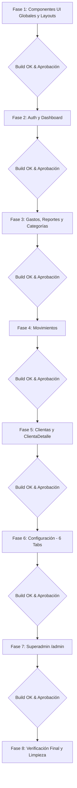

# 📋 PLAN AJUSTADO DE REFACTORIZACIÓN ESTRUCTURAL

> **Proyecto:** `control-deudas-web` (React 19 + Vite 8 + Supabase)  
> **Estrategia:** Refactorización Estructural Conservadora por Fases con Verificación Continua y Aprobación Manual.  
> **Prioridad:** 0% cambios en lógica de negocio, bases de datos, APIs, RPC, RLS, consultas, rutas ni aspecto visual.

---

## 🛡️ REGLAS ESTRICTAS DE EJECUCIÓN

1. **Sin Cambios de Lógica ni Backend:**  
   No se modifican tablas, columnas, funciones RPC, políticas RLS, consultas de Supabase, nombres de métodos de services, autenticación, rutas públicas/privadas ni clases CSS base.
2. **Separación de Dos Pasos (Desacoplamiento Seguro):**  
   * **Paso 1 (Estructural):** Mover archivos, actualizar imports, extraer subcomponentes preservando la lógica/estado existente exactamente igual, verificar compilación.
   * **Paso 2 (Hooks opcionales en fases posteriores):** Extraer lógica a custom hooks únicamente tras validar que la estructura modular funciona al 100%.
3. **Servicios Compartidos vs Servicios de Feature:**  
   * `cuentasService.js` (878 líneas) es un servicio de dominio transversal (consumido por Clientas, Movimientos y Reportes). **Permanecerá centralizado en `src/services/cuentasService.js`** para no crear dependencias cruzadas entre features.
   * `backupService.js` y `cloudinaryService.js` permanecen en `src/services/`.
   * Los servicios exclusivos de una feature (`clientasService`, `gastosService`, `categoriasService`, `reportesService`, `usuariosService`, `negociosService`) pertenecerán a su respectiva feature o a `src/services/` con imports directos y explícitos (sin `index.js` artificiales permanentes).
4. **Patrón de Carpetas para Componentes con CSS:**  
   ```
   Componente/
   ├── Componente.jsx
   └── Componente.css
   ```
   Se evita la sobrefragmentación de CSS; solo se separan estilos cuando hay una responsabilidad clara e independiente.
5. **Ubicación de App y Contextos:**  
   * `App.jsx` permanece en `src/App.jsx`.
   * `src/context/` (`AuthContext`, `ConfigContext`, `ThemeContext`, `ToastContext`) se conserva global e intacto en su funcionamiento.
6. **Protocolo de Parada y Aprobación Manual:**  
   Al finalizar cada fase se ejecutará `npm run build`, se comprobará la ausencia de imports rotos o archivos huérfanos, y **se detendrá el avance** para emitir un reporte detallado y esperar aprobación manual antes de iniciar la siguiente.

---

## 📂 PROPUESTA EXACTA DE ESTRUCTURA FINAL

```
src/
├── App.jsx
├── main.jsx
├── index.css
├── assets/
│
├── components/
│   ├── ui/
│   │   ├── Button/
│   │   │   ├── Button.jsx
│   │   │   └── Button.css
│   │   ├── Modal/
│   │   │   ├── Modal.jsx
│   │   │   └── Modal.css
│   │   ├── LoadingSpinner/
│   │   │   ├── LoadingSpinner.jsx
│   │   │   └── LoadingSpinner.css
│   │   ├── EmptyState/
│   │   │   ├── EmptyState.jsx
│   │   │   └── EmptyState.css
│   │   └── StatCard/
│   │       ├── StatCard.jsx
│   │       └── StatCard.css
│   ├── layout/
│   │   ├── Layout/
│   │   │   ├── Layout.jsx
│   │   │   └── Layout.css
│   │   ├── ProtectedRoute.jsx
│   │   └── AdminRoute.jsx
│   └── common/
│       └── ImageUploader/
│           ├── ImageUploader.jsx
│           └── ImageUploader.css
│
├── features/
│   ├── auth/
│   │   ├── pages/
│   │   │   └── Login.jsx
│   │   └── styles/
│   │       └── Login.css
│   │
│   ├── dashboard/
│   │   ├── pages/
│   │   │   └── Dashboard.jsx
│   │   └── styles/
│   │       └── Dashboard.css
│   │
│   ├── clientas/
│   │   ├── pages/
│   │   │   ├── Clientas.jsx
│   │   │   └── ClientaDetalle.jsx
│   │   ├── components/
│   │   │   ├── ClientaCard/
│   │   │   │   ├── ClientaCard.jsx
│   │   │   │   └── ClientaCard.css
│   │   │   ├── ClientaHeaderInfo/
│   │   │   │   ├── ClientaHeaderInfo.jsx
│   │   │   │   └── ClientaHeaderInfo.css
│   │   │   ├── CuentaCard/
│   │   │   │   ├── CuentaCard.jsx
│   │   │   │   └── CuentaCard.css
│   │   │   ├── MovimientoItem/
│   │   │   │   ├── MovimientoItem.jsx
│   │   │   │   └── MovimientoItem.css
│   │   │   ├── ModalCargo/
│   │   │   │   ├── ModalCargo.jsx
│   │   │   │   └── ModalCargo.css
│   │   │   ├── ModalAbono/
│   │   │   │   ├── ModalAbono.jsx
│   │   │   │   └── ModalAbono.css
│   │   │   ├── ModalCompartirCuenta/
│   │   │   │   ├── ModalCompartirCuenta.jsx
│   │   │   │   └── ModalCompartirCuenta.css
│   │   │   ├── ModalNotaCuenta/
│   │   │   │   └── ModalNotaCuenta.jsx
│   │   │   ├── ModalInlineCategoria/
│   │   │   │   └── ModalInlineCategoria.jsx
│   │   │   └── VoucherCaptura/
│   │   │       ├── VoucherCaptura.jsx
│   │   │       └── VoucherCaptura.css
│   │   ├── services/
│   │   │   └── clientasService.js
│   │   └── styles/
│   │       ├── Clientas.css
│   │       └── ClientaDetalle.css
│   │
│   ├── movimientos/
│   │   ├── pages/
│   │   │   └── Movimientos.jsx
│   │   ├── components/
│   │   │   ├── MovimientosFiltrosBar/
│   │   │   │   ├── MovimientosFiltrosBar.jsx
│   │   │   │   └── MovimientosFiltrosBar.css
│   │   │   └── ModalFiltrosMovimientos/
│   │   │       ├── ModalFiltrosMovimientos.jsx
│   │   │       └── ModalFiltrosMovimientos.css
│   │   └── styles/
│   │       └── Movimientos.css
│   │
│   ├── gastos/
│   │   ├── pages/
│   │   │   └── Gastos.jsx
│   │   ├── components/
│   │   │   ├── GastoFiltros/
│   │   │   │   └── GastoFiltros.jsx
│   │   │   ├── ModalCrearEditarGasto/
│   │   │   │   └── ModalCrearEditarGasto.jsx
│   │   │   └── GastoItem/
│   │   │       └── GastoItem.jsx
│   │   ├── services/
│   │   │   └── gastosService.js
│   │   └── styles/
│   │       └── Gastos.css
│   │
│   ├── categorias/
│   │   ├── components/
│   │   │   ├── ModalCrearEditarCategoria.jsx
│   │   │   └── ModalEliminarCategoria.jsx
│   │   └── services/
│   │       └── categoriasService.js
│   │
│   ├── reportes/
│   │   ├── pages/
│   │   │   └── Reportes.jsx
│   │   ├── services/
│   │   │   └── reportesService.js
│   │   └── styles/
│   │       └── Reportes.css
│   │
│   ├── configuracion/
│   │   ├── pages/
│   │   │   └── Configuracion.jsx
│   │   ├── components/
│   │   │   ├── TabPerfil/
│   │   │   │   └── TabPerfil.jsx
│   │   │   ├── TabNegocio/
│   │   │   │   └── TabNegocio.jsx
│   │   │   ├── TabCategorias/
│   │   │   │   └── TabCategorias.jsx
│   │   │   ├── TabApariencia/
│   │   │   │   └── TabApariencia.jsx
│   │   │   ├── TabSeguridad/
│   │   │   │   └── TabSeguridad.jsx
│   │   │   └── TabRespaldo/
│   │   │       └── TabRespaldo.jsx
│   │   └── styles/
│   │       └── Configuracion.css
│   │
│   └── admin/
│       ├── pages/
│       │   ├── AdminDashboard.jsx
│       │   ├── AdminNegocios.jsx
│       │   └── AdminUsuarios.jsx
│       ├── components/
│       │   ├── AdminLayout/
│       │   │   ├── AdminLayout.jsx
│       │   │   └── AdminLayout.css
│       │   ├── ModalCrearUsuario.jsx
│       │   ├── ModalEditarUsuario.jsx
│       │   ├── ModalPasswordUsuario.jsx
│       │   └── ModalCrearEditarNegocio.jsx
│       ├── services/
│       │   ├── usuariosService.js
│       │   └── negociosService.js
│       └── styles/
│           ├── AdminDashboard.css
│           ├── AdminNegocios.css
│           └── AdminUsuarios.css
│
├── context/
│   ├── AuthContext.jsx
│   ├── ConfigContext.jsx
│   ├── ThemeContext.jsx
│   ├── ToastContext.jsx
│   └── Toast.css
│
├── lib/
│   └── supabaseClient.js
│
├── services/
│   ├── cuentasService.js  <-- SERVICIO COMPARTIDO (Clientas + Movimientos + Reportes)
│   ├── backupService.js   <-- SERVICIO COMPARTIDO (Configuración / Respaldo)
│   └── cloudinaryService.js <-- SERVICIO COMPARTIDO (Subida de imágenes)
│
├── theme/
│   └── colors.js
│
└── utils/
    └── helpers.js
```

---

## 🚦 PLAN DE MIGRACIÓN POR FASES (CON PARADAS Y REPORTES)



### 🔹 Fase 1: Componentes Globales UI, Layouts y Comunes
* **Objetivo:** Organizar `src/components/` en `ui/`, `layout/` y `common/`.
* **Archivos a mover:**
  * `Button.jsx`, `Button.css` ➔ `components/ui/Button/`
  * `Modal.jsx`, `Modal.css` ➔ `components/ui/Modal/`
  * `LoadingSpinner.jsx`, `LoadingSpinner.css` ➔ `components/ui/LoadingSpinner/`
  * `EmptyState.jsx`, `EmptyState.css` ➔ `components/ui/EmptyState/`
  * `StatCard.jsx`, `StatCard.css` ➔ `components/ui/StatCard/`
  * `Layout.jsx`, `Layout.css` ➔ `components/layout/Layout/`
  * `ProtectedRoute.jsx`, `AdminRoute.jsx` ➔ `components/layout/`
  * `ImageUploader.jsx`, `ImageUploader.css` ➔ `components/common/ImageUploader/`
* **Actualización de imports en:** `App.jsx`, páginas y admin.
* **Verificación:** `npm run build`.
* **Detención y Reporte.**

### 🔹 Fase 2: Módulo Auth y Dashboard
* **Objetivo:** Trasladar Login y Dashboard a `src/features/`.
* **Archivos a mover:**
  * `pages/Login.jsx`, `pages/Login.css` ➔ `features/auth/`
  * `pages/Dashboard.jsx`, `pages/Dashboard.css` ➔ `features/dashboard/`
* **Actualización de imports en:** `App.jsx`.
* **Verificación:** `npm run build`.
* **Detención y Reporte.**

### 🔹 Fase 3: Módulo Gastos, Reportes y Categorías
* **Objetivo:** Migrar features autónomas sin tocar lógica de negocio.
* **Archivos a mover/estructurar:**
  * `pages/Gastos.jsx`, `pages/Gastos.css`, `services/gastosService.js` ➔ `features/gastos/`
  * `pages/Reportes.jsx`, `pages/Reportes.css`, `services/reportesService.js` ➔ `features/reportes/`
  * `services/categoriasService.js` ➔ `features/categorias/services/`
* **Actualización de imports correspondientes.**
* **Verificación:** `npm run build`.
* **Detención y Reporte.**

### 🔹 Fase 4: Módulo Movimientos
* **Objetivo:** Migrar Movimientos conectando con el servicio compartido `src/services/cuentasService.js`.
* **Archivos a mover/modularizar:**
  * `pages/Movimientos.jsx`, `pages/Movimientos.css` ➔ `features/movimientos/`
  * Extracción conservadora de `MovimientosFiltrosBar` y `ModalFiltrosMovimientos`.
* **Verificación:** `npm run build`.
* **Detención y Reporte.**

### 🔹 Fase 5: Módulo Clientas y ClientaDetalle (Paso Crítico)
* **Objetivo:** Modularizar `ClientaDetalle.jsx` (2,285 líneas) mediante extracción de subcomponentes puros manteniendo la lógica y estados exactos.
* **Archivos a mover/extraer:**
  * `pages/Clientas.jsx`, `pages/Clientas.css`, `components/ClientaCard.*`, `services/clientasService.js` ➔ `features/clientas/`
  * `ClientaDetalle.jsx` / `ClientaDetalle.css`:
    * `ClientaHeaderInfo/`
    * `CuentaCard/`
    * `MovimientoItem/`
    * `ModalCargo/`
    * `ModalAbono/`
    * `ModalCompartirCuenta/`
    * `ModalNotaCuenta/`
    * `ModalInlineCategoria/`
    * `VoucherCaptura/` (DOM y captura de canvas idénticos)
* **Verificación:** `npm run build`.
* **Detención y Reporte.**

### 🔹 Fase 6: Módulo Configuración
* **Objetivo:** Descomponer `Configuracion.jsx` (1,603 líneas) en sus 6 pestañas funcionales sin alterar su comportamiento.
* **Archivos a mover/extraer:**
  * `pages/Configuracion.jsx`, `pages/Configuracion.css` ➔ `features/configuracion/`
  * Extraer: `TabPerfil`, `TabNegocio`, `TabCategorias`, `TabApariencia`, `TabSeguridad`, `TabRespaldo`.
* **Verificación:** `npm run build`.
* **Detención y Reporte.**

### 🔹 Fase 7: Módulo Superadmin (`/admin`)
* **Objetivo:** Estructurar la administración de plataforma en `features/admin/`.
* **Archivos a mover/extraer:**
  * `admin/components/AdminLayout.*` ➔ `features/admin/components/AdminLayout/`
  * `admin/pages/AdminDashboard.*` ➔ `features/admin/pages/`
  * `admin/pages/AdminNegocios.*`, `services/negociosService.js` ➔ `features/admin/`
  * `admin/pages/AdminUsuarios.*`, `services/usuariosService.js` ➔ `features/admin/`
  * Extraer modales (`ModalCrearUsuario`, `ModalEditarUsuario`, `ModalPasswordUsuario`, `ModalCrearEditarNegocio`).
* **Verificación:** `npm run build`.
* **Detención y Reporte.**

### 🔹 Fase 8: Verificación Final y Limpieza
* **Objetivo:** Revisar que no existan archivos vacíos, huérfanos o duplicados, y comprobar compilación general y consistencia de rutas.
* **Verificación:** `npm run build`.
* **Detención y Reporte Final.**

---

> 🔒 **Estado:** Esperando confirmación para ejecutar la **Fase 1** (Componentes Globales UI, Layouts y Comunes).
